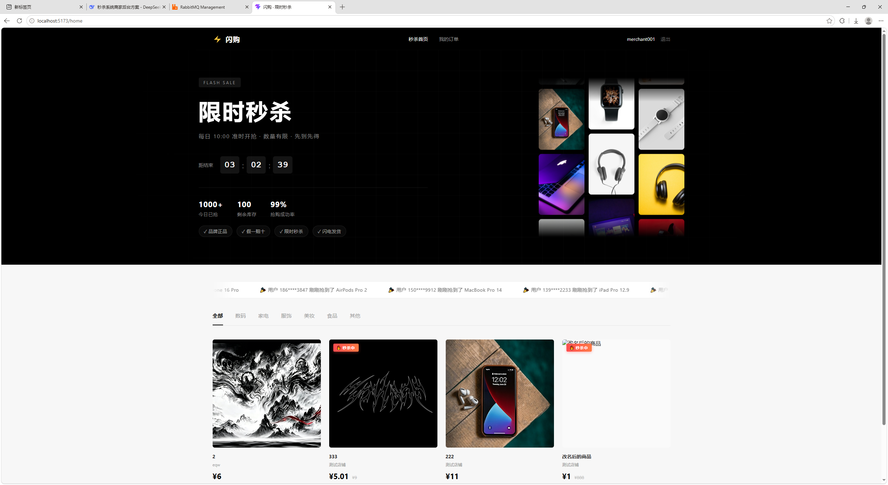
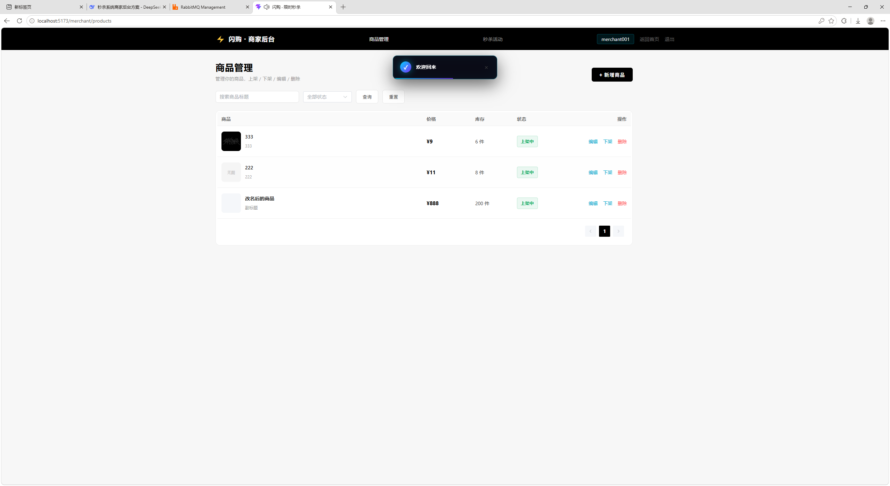
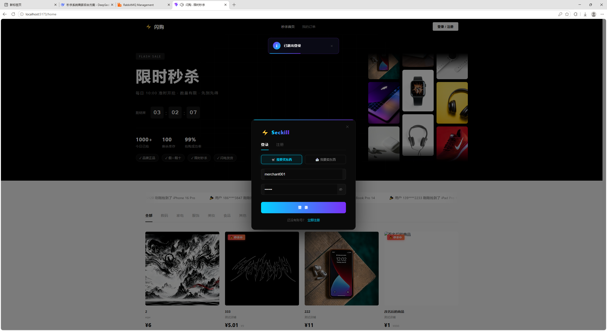
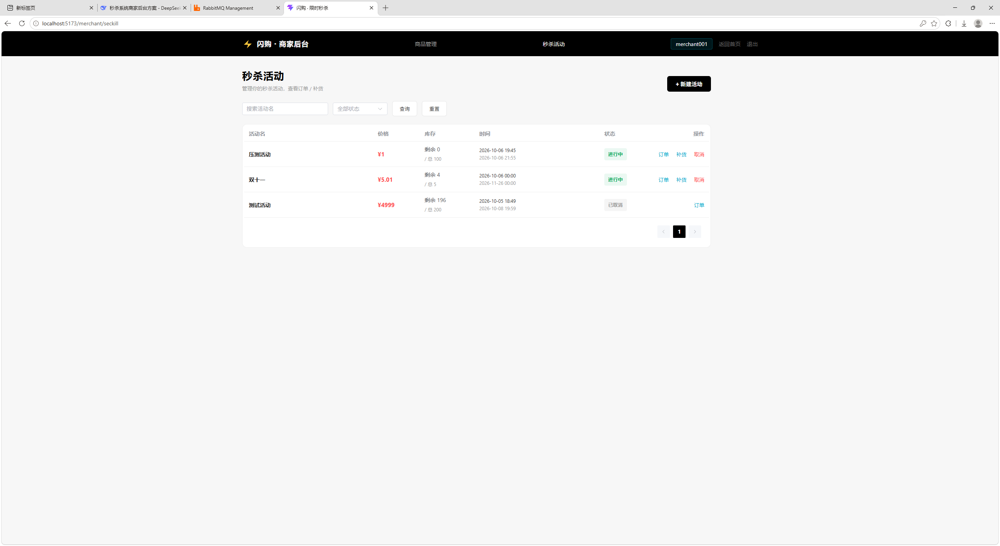
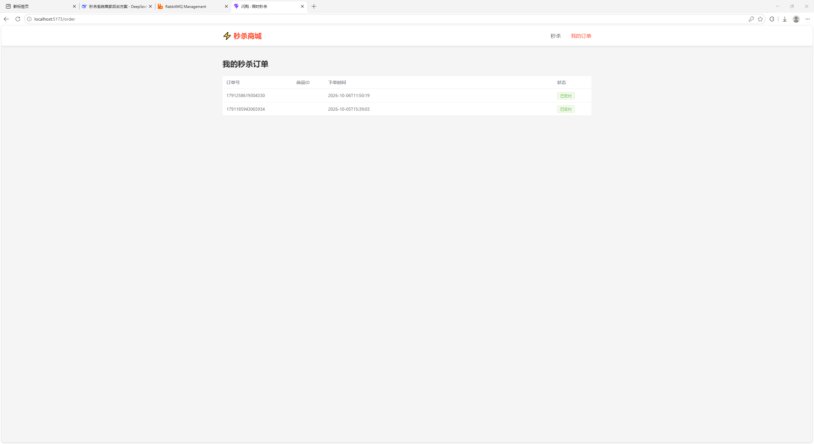

# 秒杀系统 Seckill System

> 🚀 高并发秒杀系统 —— Spring Boot 3 + Vue 3 + Redis + RabbitMQ
> **1000 并发零超卖** | Redis + Lua 原子扣减 | MQ 异步下单 | 三层权限防御


---

## 📖 项目简介

一个前后端分离的**高并发秒杀电商系统**，实现了从 **用户注册 → 商品浏览 → 秒杀下单 → 订单查看** 的完整闭环，以及 **商家后台**（商品管理 + 秒杀活动管理）。

**核心目标**：在**高并发场景下**保证 **不超卖**、**不重复秒杀**、**异步下单不阻塞**。

**核心成果**：**1000 并发零超卖** —— 订单数精确等于库存数。

---

## 🛠 技术栈

| 层 | 技术 |
|----|------|
| **后端** | Spring Boot 3.2.5、MyBatis-Plus 3.5.5、Spring Session |
| **前端** | Vue 3、Vite、Element Plus、Pinia、Vue Router 4 |
| **数据库** | MySQL 8 |
| **缓存** | Redis 7（Lua 脚本） |
| **消息队列** | RabbitMQ 3.12 |
| **部署** | Docker、Docker Compose |

---

## ✨ 核心功能

### 用户端
- ✅ 注册 / 登录（**买家 / 商家**身份选择，手机号 + 邮箱 + 商铺信息）
- ✅ 首页商品列表（带 **「🔥 秒杀中」** 标签）
- ✅ 秒杀下单（**requestId + 轮询结果**）
- ✅ 我的订单

### 商家端
- ✅ 商品管理（增删改查 + **图片上传** + 上下架 + 软删）
- ✅ 秒杀活动管理（新建 / 编辑 / 取消）
- ✅ 活动**补货**（Lua INCRBY 原子加库存）
- ✅ 查看活动**订单**

### 系统
- ✅ **定时任务状态机**（活动 0→1→2 自动流转）
- ✅ Redis **预热 / 清理**
- ✅ **三层权限防御** + 全局异常处理
- ✅ **分布式 Session**（Spring Session + Redis）

---

## 🏗 架构设计

```
┌──────────────┐
│   浏览器      │
│  Vue 3 SPA   │
└──────┬───────┘
       │ HTTP (axios + Session Cookie)
       ▼
┌──────────────────────────────────────┐
│         Spring Boot 应用             │
│  ┌────────────────────────────────┐  │
│  │ MerchantAuthInterceptor (权限) │  │
│  └────────────────────────────────┘  │
│  ┌────────────────────────────────┐  │
│  │  Controller 层                 │  │
│  └────────────────────────────────┘  │
│  ┌────────────────────────────────┐  │
│  │  Service 层                    │  │
│  │  - Redis + Lua 扣库存           │  │
│  │  - 防重 key（TTL = 活动时长）    │  │
│  │  - 生成 requestId               │  │
│  │  - 发 MQ 消息                   │  │
│  └────────────────────────────────┘  │
│  ┌────────────────────────────────┐  │
│  │  SeckillConsumer（MQ 消费）     │  │
│  │  - DB 扣库存                    │  │
│  │  - 创建订单                     │  │
│  │  - 结果写 Redis                 │  │
│  └────────────────────────────────┘  │
└──────┬─────────┬────────────┬────────┘
       │         │            │
       ▼         ▼            ▼
   ┌──────┐ ┌────────┐ ┌──────────┐
   │Redis │ │RabbitMQ│ │  MySQL   │
   └──────┘ └────────┘ └──────────┘
```

---

## 📊 压测数据

### 压测环境

| 项 | 值 |
|----|-----|
| 机器 | Windows 11 / 16GB RAM |
| 后端 | Spring Boot 3.2.5 单实例 |
| 数据库 | MySQL 8（Docker） |
| 缓存 | Redis 7（Docker） |
| 消息队列 | RabbitMQ 3.12（Docker） |
| 压测工具 | Apache JMeter 5.6.3（命令行模式） |
| 并发用户 | **1000** |
| Ramp-up | 1 秒 |

### 压测结果

| 指标 | 值 |
|------|-----|
| **# Samples** | **1000** |
| **总耗时** | **3 秒** |
| **吞吐量** | **689.7 req/sec** |
| **平均响应时间** | **751 ms** |
| **最小响应** | **115 ms** |
| **最大响应** | **1453 ms** |
| **错误率** | **0.00%** |

### 正确性验证

| 项 | 期望 | 实际 | 结果 |
|----|------|------|------|
| **DB 订单数** | = 库存（100） | **100** | ✅ |
| **DB 活动 stock** | 0 | **0** | ✅ |
| **Redis stock** | 0 | **0** | ✅ |
| **MQ 队列堆积** | 0 | **0** | ✅ |
| **超卖数量** | 0 | **0** | ✅ **零超卖** |

**结论**：**1000 并发请求、活动库存 100、最终订单数精确 = 100** —— **并发安全验证通过**。

---

## 🔥 技术难点

### 1. 防超卖：Redis + Lua 原子扣减

**问题**：高并发下 `GET` + `DECR` 两条命令不是原子的 —— 可能超卖。

**方案**：用 **Lua 脚本**把「读库存 + 判断 + 扣减」打包，Redis **单线程执行 Lua** 保证原子性。

```lua
local stock = redis.call('GET', KEYS[1])
if not stock then return -1 end
if tonumber(stock) <= 0 then return -2 end
redis.call('DECR', KEYS[1])
return redis.call('GET', KEYS[1])
```

**效果**：**1000 并发下零超卖**。

### 2. 异步下单：RabbitMQ 削峰

**问题**：秒杀瞬时高并发 —— 同步下单会阻塞，DB 压力大。

**方案**：
1. **Redis 扣减成功** → **立即返回 `requestId`**（几十毫秒）
2. **发 MQ 消息** → **消费者异步创建订单**
3. **前端轮询** `/seckill/result/{requestId}` 查询结果

**效果**：**接口响应时间从几百 ms 降到 10ms 级**。

### 3. 防重复秒杀

**方案**：`seckill:user:{userId}:{activityId}` 防重 key，**TTL = 活动剩余时长**。

**关键**：**扣库存失败时删除防重 key** —— **避免用户被误锁**（面试可讲）。

```java
if (result == null || result <= 0) {
    redisTemplate.delete(userKey);     // ← 关键：回滚
    return Result.fail(ResultCode.STOCK_EMPTY);
}
```

### 4. 三层权限防御

| 层 | 位置 | 拦截内容 |
|----|------|---------|
| 1 | `MerchantAuthInterceptor` | 未登录 / 非商家角色 |
| 2 | Service 层查询过滤 | 列表只返回自己的 |
| 3 | Service 层归属校验 | 详情 / 编辑 / 删除先查后校验 |

**错误码**：
- **3001** 商品不存在 / **3002** 无权操作该商品
- **3003** 活动不存在 / **3004** 无权操作该活动

**效果**：**A 商家无法访问 B 商家的任何资源** —— 双向隔离测试全通过。

### 5. 分布式会话

**方案**：**Spring Session + Redis** —— Session 存 Redis，多实例共享。

**注意点**：
- 跨域请求需 `withCredentials: true`
- 后端 CORS 用 `allowedOriginPatterns` + `allowCredentials(true)`（**不能用 `allowedOrigins("*")`**）

### 6. 定时任务状态机

**方案**：`@Scheduled` 每分钟扫描 `seckill_activity` ——
- `status=0 AND start_time <= now` → **改 1 + 预热 Redis**（`setIfAbsent`）
- `status=1 AND end_time <= now` → **改 2 + 清理 Redis**

**关键**：**用 `setIfAbsent` 避免覆盖正在跑的库存**。

---

## 📸 项目截图

### 首页


### 登录弹窗（身份选择 + 手机 / 邮箱 / 商铺）


### 商家后台 - 商品管理


### 商家后台 - 秒杀活动


### 订单页


---

## 🚀 快速开始

### 前置要求

- JDK 17+
- Node.js 18+
- Docker & Docker Compose
- Maven 3.8+

### 1. 启动依赖服务

```bash
docker-compose up -d
```

启动：MySQL 8、Redis 7、RabbitMQ 3.12。

### 2. 初始化数据库

```bash
mysql -h 127.0.0.1 -u root -proot123 < sql/init.sql
```

### 3. 启动后端

```bash
cd backend
mvn clean package -DskipTests
java -jar target/seckill-system-0.0.1-SNAPSHOT.jar
```

后端：http://localhost:8080

### 4. 启动前端

```bash
cd frontend
npm install
npm run dev
```

前端：http://localhost:5173

### 5. 测试账号

| 角色 | 用户名 | 密码 | 说明 |
|------|--------|------|------|
| 商家 | merchant001 | 123456 | 可进商家后台 |
| 买家 | user001 | 123456 | 可秒杀下单 |

---

## 📁 项目结构

```
seckill-system/
├── backend/
│   ├── src/main/java/com/example/MiaoShaSystem/
│   │   ├── common/         # Result / 异常 / 工具类
│   │   ├── config/         # Redis / RabbitMQ / Web 配置
│   │   ├── controller/     # 接口层
│   │   ├── dto/            # 请求 DTO
│   │   ├── entity/         # 实体
│   │   ├── interceptor/    # 拦截器
│   │   ├── mapper/         # Mapper
│   │   ├── mq/             # MQ 消息 + 消费者
│   │   ├── scheduler/      # 定时任务
│   │   ├── service/        # Service 层
│   │   └── vo/             # 响应 VO
│   └── src/main/resources/
│       ├── lua/            # Lua 脚本
│       └── application.yml
│
├── frontend/
│   ├── src/
│   │   ├── api/            # axios 封装
│   │   ├── components/     # 公共组件
│   │   ├── router/         # 路由
│   │   ├── store/          # Pinia
│   │   ├── styles/         # 全局样式
│   │   ├── utils/          # 工具
│   │   └── views/
│   │       ├── Home.vue
│   │       ├── Order.vue
│   │       └── merchant/   # 商家后台
│   └── vite.config.js
│
├── sql/
│   └── init.sql
├── docs/
│   └── screenshots/
├── docker-compose.yml
└── README.md
```

---

## 🎯 面试可讲点

1. **为什么用 Redis 扣库存** —— 高性能 + 原子性
2. **为什么用 Lua** —— 多条命令原子执行
3. **为什么用 MQ** —— 削峰 + 异步 + 失败重试
4. **怎么防超卖** —— Lua + DB 双扣
5. **怎么防重复秒杀** —— Redis 防重 key + TTL + 失败回滚
6. **结果查询怎么做** —— requestId + 轮询
7. **怎么保证 Redis 和 DB 一致** —— 补货同步 + 对账任务
8. **Session 怎么共享** —— Spring Session + Redis
9. **权限怎么控制** —— 三层防御（拦截器 + 查询过滤 + 归属校验）
10. **状态机怎么做** —— 定时任务 + 状态字段

---

## 📝 TODO

- [ ] 图片上传接 OSS
- [ ] 密码加盐（BCrypt）
- [ ] JWT 替代 Session
- [ ] 商家 Dashboard（今日订单 / 销售额）
- [ ] 导出订单 Excel

---

## 📄 License

MIT

---

## 👤 作者

**lzx14460**
- GitHub: [@lzx14460](https://github.com/lzx14460)